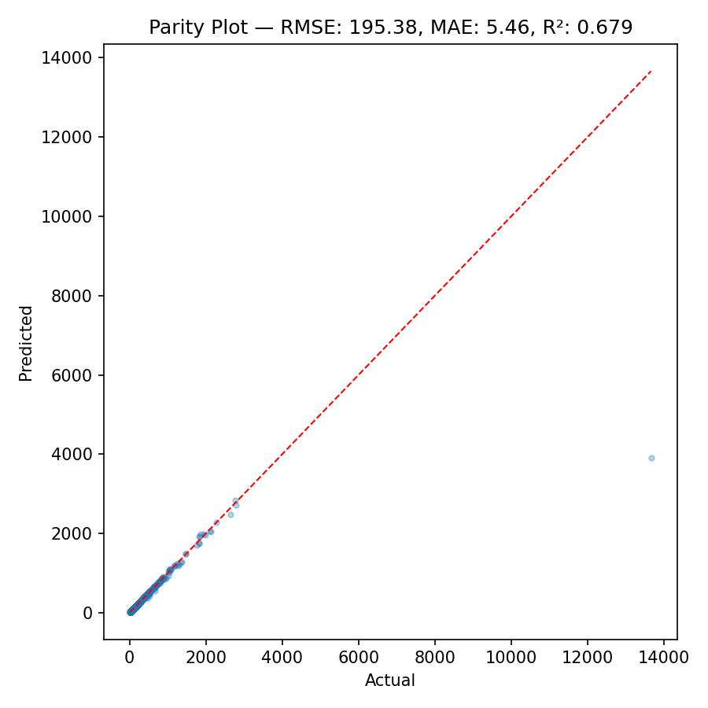
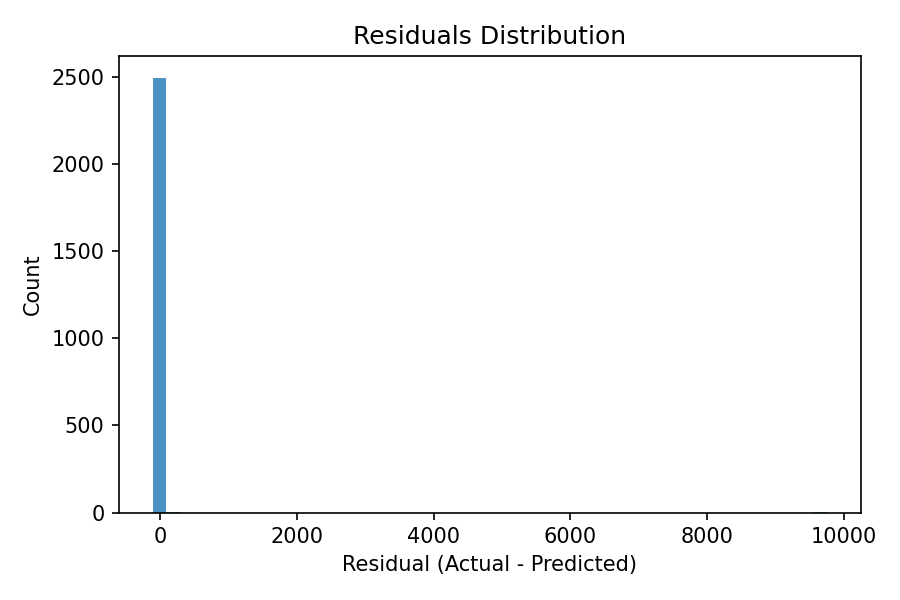
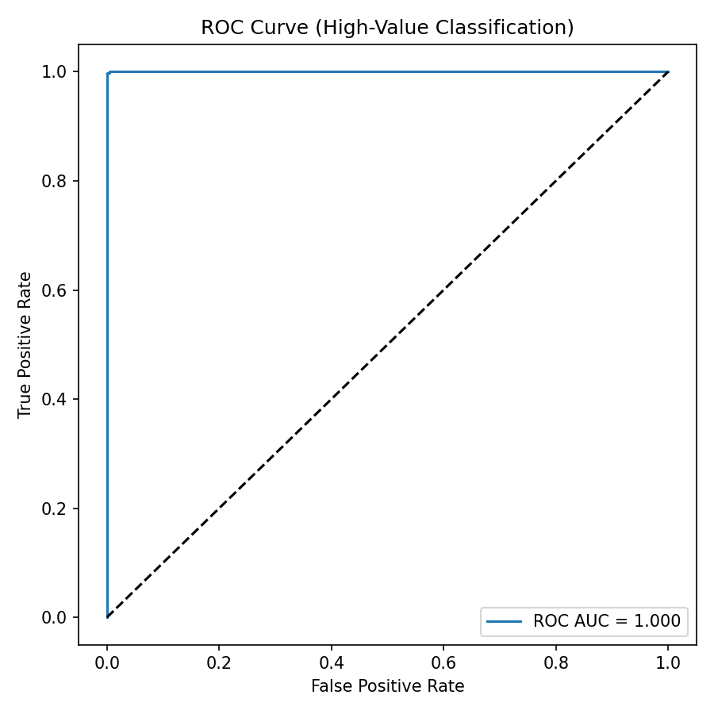
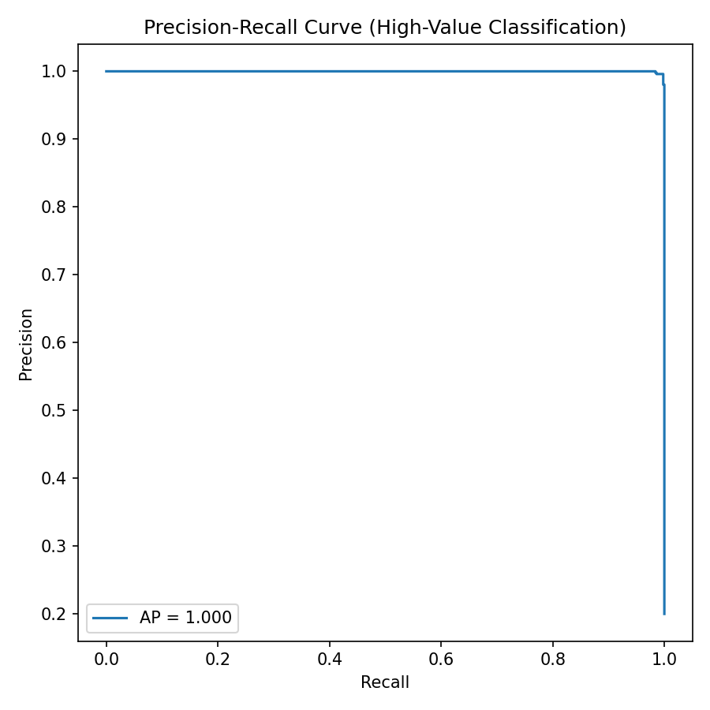
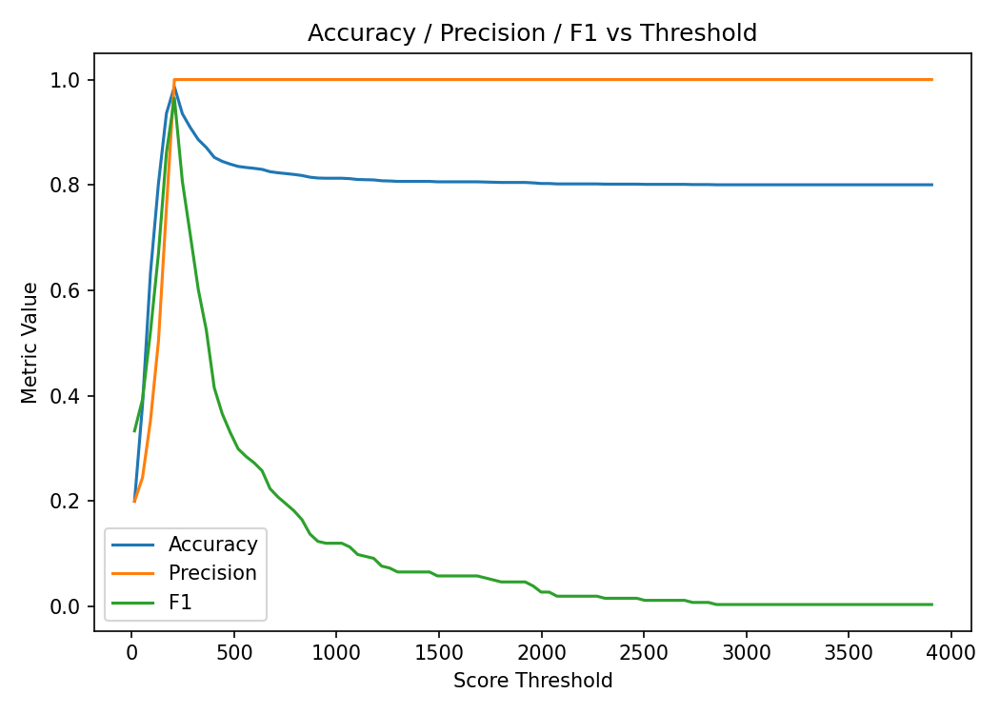
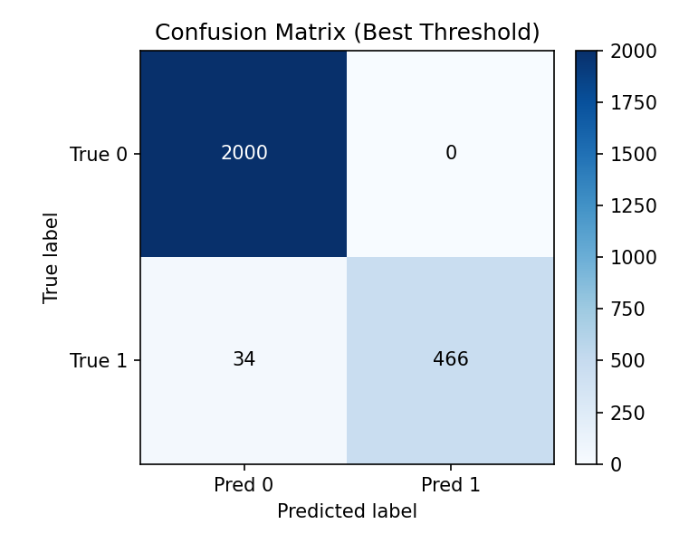

# Model Evaluation Report

Below are the generated evaluation plots for the order total model. Open this file's Markdown preview in VS Code to see the images inline.

## Regression Diagnostics

- Parity Plot: compares predicted vs. actual totals

- Residuals Distribution: error distribution (actual − predicted)

## Classification (High-Value Orders)

Using a high-value threshold derived from the 0.8 quantile of the target for evaluation-only framing.

- ROC Curve

- Precision–Recall Curve

### Accuracy / Precision / F1 vs Threshold

This shows how metrics change as the score threshold varies.

Best-threshold snapshot (bar chart):

### Confusion Matrix (Best Threshold)

## Summary JSON

A machine-readable summary with metrics and artifact paths:

- `evaluation_summary.json`
